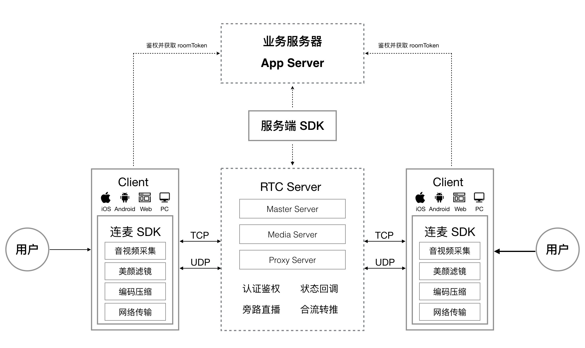
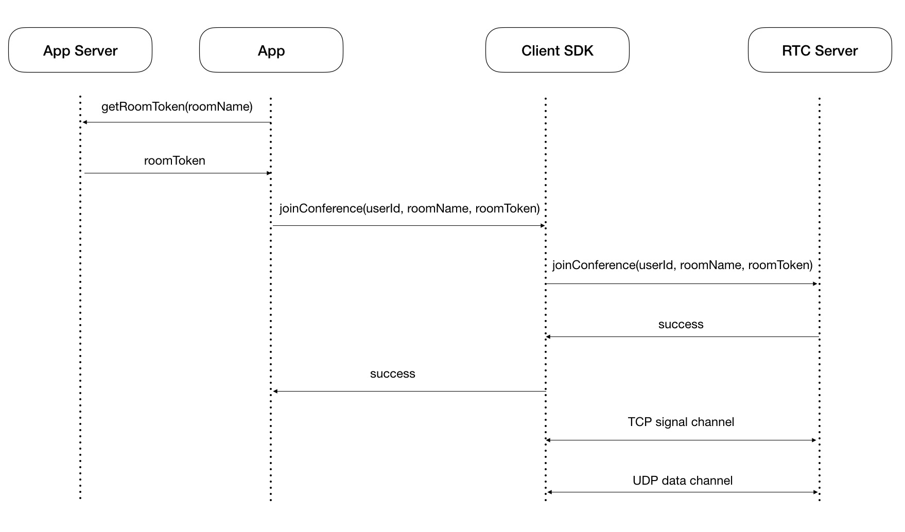
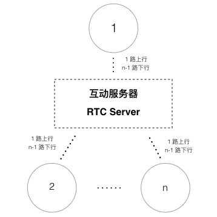
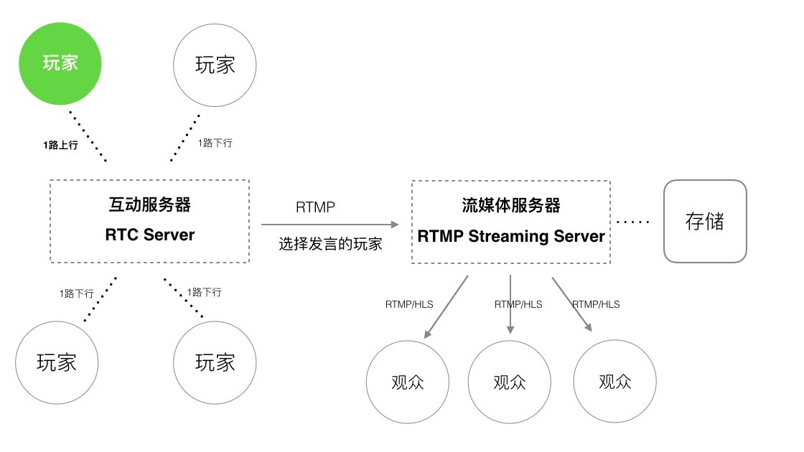
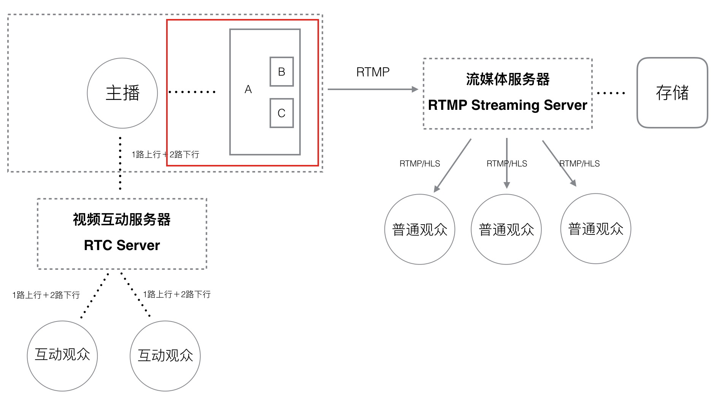
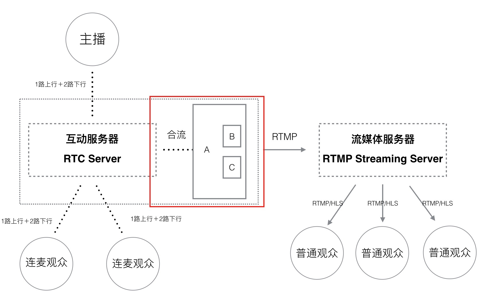

# PLRTCStreamingKit

PLRTCStreamingKit 是七牛推出的一款适用于 iOS 平台的连麦互动 SDK，支持低延时音视频通话、RTMP 直播推流，可快速开发一对一视频聊天、多人视频会议、网红直播连麦、狼人杀、娃娃机等应用，接口简单易用。支持高度定制以及二次开发。

## 1 功能列表
- 基本的推流和连麦对讲功能
- 基本的视频合流和音频混音功能
- 支持内置音视频采集，支持美颜、水印、闪光灯、摄像头切换、聚焦等常见功能
- 支持外部采集视频数据，支持的格式为：RGB
- 支持外部采集音频数据，支持的格式为：PCM，单通道，16bit 位宽
- 支持外部美颜
- 支持踢人功能
- 支持静音功能
- 支持连麦的帧率配置
- 支持连麦的视频码率的配置
- 支持连麦的视频尺寸配置
- 支持丰富的连麦消息回调
- 支持纯音频连麦
- 支持左右 PK 模式连麦
- 支持连麦大小窗口切换
- 支持推流的软硬编配置
- 支持连麦的软硬编配置
- 支持连麦画面的截帧
- 支持动态开关音视频

## 2 系统介绍
七牛连麦系统支持低延时音视频通话，提供灵活丰富的接口，方便进行二次开发。该系统主要包括连麦服务端和客户端两个部分，其中，连麦服务端主要提供了房间管理、权限验证、信令和媒体数据转发等功能，客户端则提供了媒体数据的采集、编码、传输、显示等功能。

### 2.1 系统框图

整个连麦系统的架构如上图所示。主要分为三个部分：

- <b> 客户端 SDK </b>
  
  主要负责客户端的音视频采集、渲染、滤镜处理、编解码、传输等工作
  
- <b> 服务端 REST API 和 SDK </b>
 
  主要提供房间管理、状态回调等业务功能
 
- <b> 连麦服务器 </b>

  主要负责信令交互、音视频传输、代理加速等工作

### 2.2 交互流程

连麦交互流程如上图所示，因此，App 服务端需要开发的工作如下：

- 为主播创建连麦房间，并将连麦房间和对应主播的 Id 关联起来
- 计算连麦的 roomToken 并提供给 App，该 roomToken 是结合 userId、roomName 等信息使用七牛的 AccessKey 和 SecretKey 按照一定的规则生成
- 提供连麦的业务逻辑，如：观众申请连麦，主播同意/拒绝连麦、进入/退出房间等消息处理

关于 roomToken 的计算方法及 RTC Server API 的说明请查阅 [Server 连麦 SDK](https://developer.qiniu.com/pili/sdk/1640/server-rtc-sdk) ，另外，我们也开源了一份[ App Server 的实现代码供开发者参考](https://github.com/pili-engineering/pili-sdk-demo-server)。

### 2.3 房间管理
连麦本质上是一个视频会议，因此我们引入了连麦房间的概念，用于隔离不同主播的连麦过程，保障数据的安全及独立。连麦系统要求连麦的各方必须首先进入同一个连麦房间，然后才能开始视频会议的过程。

房间的 API 主要分为两个部分，一部分在客户端，另一部分在服务端。在客户端 SDK 中，只有加入/离开连麦房间的接口。我们把创建/销毁连麦房间的功能放到了服务端，由 App Server 向七牛的服务器发送请求来完成。关于服务端 API 的详细内容，请查阅 [Server 连麦 SDK](https://developer.qiniu.com/pili/sdk/1640/server-rtc-sdk)。

## 3 应用场景
### 3.1 视频会议

如图所示，仅用连麦系统就可以满足视频会议场景的需求。假设有 n 个人参与会议，对于连麦系统来讲，这 n 个人的角色都是一致的，每个人需要上行一路自己的流到 RTC Server，同时拉取会议中的其它 n-1 路流到本地进行播放。与会者可以随时打开/关闭音/视频来满足不同场景的需求。

### 3.2 狼人杀

狼人杀的场景如图所示。当前正在发言的玩家，发布自己的流到 RTC Server，其它玩家从 RTC Server 拉取该玩家的流。这部分功能使用连麦系统即可完成。如果需要直播游戏过程或者落存储，则可从 RTC Server 将当前正在发言的玩家转推一路 RTMP 流到 RTMP Server 上，再通过 CDN 分发给普通观众或者落存储。

### 3.3 网红直播连麦

网红直播连麦连麦在业务上存在三种角色——主播、副主播/连麦观众、普通观众，不同的角色，业务流程是不一样的，具体介绍如下：

#### 普通观众（播放）

观众是观看者角色，从流媒体分发网络拉取直播的音视频流，其工作流程如下：

播放主播画面 -> -> -> 退出播放器

#### 副主播/连麦观众（连麦）

副主播/连麦观众是连麦后跟主播视频对讲的角色，其工作流程如下：

打开本地摄像头预览 -> 向主播申请连麦(业务服务器) -> 得到同意(业务服务器) -> 开始连麦-> -> -> 结束连麦

#### 主播

主播是直播连麦活动的从头到尾的参与者，也是整个直播连麦活动的主持者，因此，其业务逻辑也最为复杂，根据不同的业务逻辑和观看体验的需求，可以分成两种方案：客户端合流和服务端合流，分别介绍如下：

##### 客户端合流

如图所示，该方案下主播的工作流程如下：

打开本地摄像头预览 -> 初始化推流参数 -> 开始推流（主播画面）-> -> -> 收到连麦申请(业务服务器) -> 同意连麦申请(业务服务器) -> 开始连麦-> 持续推流（合成画面） -> -> -> 结束连麦-> 持续推流（主播画面）-> -> -> 结束推流

该方案的优点是延迟低、服务器资源消耗少。缺点是手机功耗较大，对主播上行带宽要求较高。

##### 服务端合流

从上图可以看出，该方案下主播的工作流程与客户端合流最大的区别是连麦过程中的合流+推流的工作由主播端转移到了服务端，因此，可降低主播手机的功耗及减轻上行带宽的压力。与此同时，也给服务器带来更大的压力和更高的性能要求。

### 3.4 在线娃娃机

如图所示，玩家与娃娃机摄像头之间数据通过 RTC Server 传输，玩家与摄像头画面经服务端合成后推流到 RTMP Server，普通观众通过 CDN 拉取观看。

## 4 文档
请参考开发文档：[PLRTCStreamingKit 开发文档](Documents/PLRTCStreamingKit.md)

## 5 反馈及意见

当你遇到任何问题时，可以通过在 GitHub 的 repo 提交 issues 来反馈问题，请尽可能的描述清楚遇到的问题，如果有错误信息也一同附带，并且在 Labels 中指明类型为 bug 或者其他。

[通过这里查看已有的 issues 和提交 Bug](https://github.com/pili-engineering/PLRTCStreamingKit/issues)

## 6 FAQ

### 6.1 连麦功能是否收费？

客户端 SDK 不收费，服务端可按照带宽、流量或者时长收费，具体请联系七牛商务或者技术支持。

### 6.2 连麦对讲延时多大？

正常网络条件下，连麦对讲延时在 200-300ms 左右。

### 6.3 如何从 v1 版本连麦更新到 v2 版本？

可参考 [这个文档](https://github.com/pili-engineering/PLDroidRTCStreaming/blob/master/docs/how-to-upgrade-to-v2.md)

### 6.4 运行 demo 后的账号密码哪里来 ？

请联系七牛的商务或者技术支持，获取账号密码。

### 6.5 是否有开源的服务端代码可以参考 ？

有的，请参考： [pili-sdk-demo-server](https://github.com/pili-engineering/pili-sdk-demo-server)

